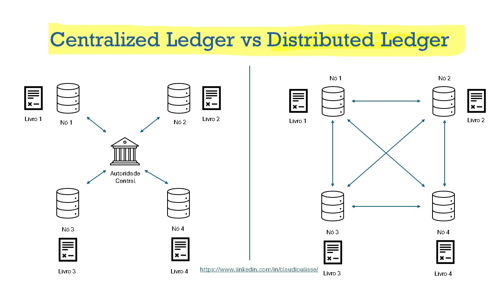
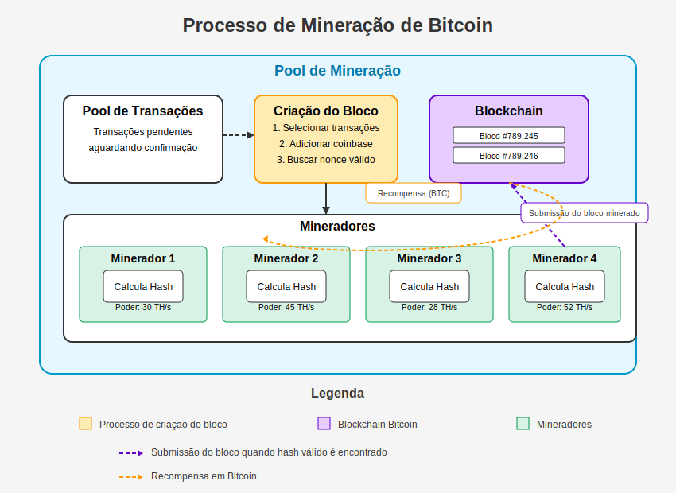

# 1. Propósito do Blockchain

O blockchain foi criado para resolver problemas de **confiança e segurança** em transações digitais, eliminando a necessidade de intermediários. Sua principal inovação é a criação de um sistema **descentralizado e imutável** que registra transações de forma segura e transparente.

> - Descentralização e Confiança: O blockchain elimina a necessidade de uma autoridade central, permitindo que as transações sejam verificadas por uma rede distribuída de participantes, aumentando a confiança e a segurança (Zhao et al., 2016; Upadhyay, 2020; Ünalan & Ozcan, 2020).
> - Segurança e Imutabilidade: Oferece um registro imutável e seguro das transações, o que é crucial para aplicações em finanças, saúde, transporte e outros setores (Jabbar et al., 2022; Yli-Huumo et al., 2016; Andoni et al., 2019).
Transparência e Eficiência: Facilita a transparência e a eficiência em processos de negócios, reduzindo custos de transação e aumentando a velocidade das operações (Zutshi et al., 2021; Andoni et al., 2019).

## Evolução Histórica

A ideia de um sistema de registro digital seguro remonta aos anos 1970 e 1990, com contribuições significativas de David Chaum e outros (Sherman et al., 2018; Kulkarni, 2019).
> - Bitcoin e Blockchain 1.0: O conceito de blockchain ganhou notoriedade com o lançamento do **Bitcoin por Satoshi Nakamoto em 2008**, que introduziu a ideia de uma moeda digital descentralizada (Larrier, 2021; Gupta & Sadoghi, 2021; Sharma et al., 2021).
> - Blockchain 2.0 e Além: Em 2014, o Ethereum introduziu contratos inteligentes, expandindo o uso do blockchain para além das criptomoedas (U. & Rajagopalan, 2021).

| **Ano**   | **Evento**                                                                                          |
|-----------|----------------------------------------------------------------------------------------------------|
| **1991**  | Stuart Haber e W. Scott Stornetta propõem a primeira ideia de blockchain, focando em carimbos de data e hora imutáveis. |
| **1992**  | Introdução das árvores Merkle, aumentando a eficiência do sistema de registro.                    |
| **2008**  | Satoshi Nakamoto publica o white paper "Bitcoin: A Peer-to-Peer Electronic Cash System", estabelecendo os fundamentos do Bitcoin e da tecnologia blockchain. |
| **2009**  | Lançamento da rede Bitcoin; Satoshi Nakamoto minera o primeiro bloco (bloco gênesis).             |
| **2010**  | Primeira transação comercial com Bitcoin: 10.000 BTC são usados para comprar duas pizzas.         |
| **2013**  | O mercado de Bitcoin supera 1 bilhão de dólares; Vitalik Buterin lança o white paper do Ethereum. |
| **2014**  | O Ethereum é financiado por meio de um crowdsale; formação do consórcio R3 com mais de 40 instituições financeiras. |
| **2015**  | Lançamento da plataforma Ethereum, que introduz contratos inteligentes; criação da Hyperledger pela Linux Foundation. |
| **2017**  | Lançamento do EOS.IO, um novo protocolo para aplicações descentralizadas.                          |
| **2018**  | A tecnologia blockchain continua a evoluir, com o aumento no número de criptomoedas e aplicações empresariais. |

O artigo completo [aqui](https://101blockchains.com/pt/historia-da-tecnologia-blockchain/).

## A primeira transação em Blockchain

A primeira transação de Bitcoin foi realizada em 12 de janeiro de 2009, apenas nove dias após o lançamento da rede Bitcoin. Satoshi Nakamoto, o criador anônimo do Bitcoin, enviou 10 Bitcoins para Hal Finney, um respeitado cientista da computação e entusiasta da criptografia.

### Detalhes da Transação

- **Data**: 12 de janeiro de 2009
- **Participantes**: Satoshi Nakamoto e Hal Finney
- **Valor**: 10 BTC
- **Significado**: Esta transação foi um marco histórico, pois demonstrou que o Bitcoin funcionava como um meio de transferência de valores, validando a viabilidade da criptomoeda como um sistema monetário digital.

Hal Finney, que recebeu a primeira transação, era conhecido por seu trabalho em sistemas criptográficos e foi uma das primeiras pessoas a operar a rede Bitcoin. A transação não só marcou o início das operações com Bitcoin, mas também estabeleceu as bases para o crescimento futuro da criptomoeda.

## Hal Finney e Satoshi Nakamoto

Hal Finney foi um cientista da computação, engenheiro de software e um dos primeiros membros do Cypherpunks. Ele é conhecido por ter recebido a primeira transação de Bitcoin de Satoshi Nakamoto, o criador anônimo do Bitcoin. Foi um defensor notável da criptografia e da privacidade digital. Também criou o primeiro sistema baseado em prova de trabalho reutilizável (RPOW), que muitos consideram um precursor do Bitcoin.
Em 12 de janeiro de 2009, Satoshi Nakamoto enviou 10 Bitcoins para Hal Finney, marcando a primeira transação de Bitcoin da história. Finney também foi a segunda pessoa a executar um nó Bitcoin. Ele relatou bugs e fez recomendações que levaram a várias melhorias no software inicial do Bitcoin.
Hal Finney faleceu em 2014 devido à Esclerose Lateral Amiotrófica (ELA) e foi criopreservado pela Alcor Life Extension Foundation. Apesar de algumas teorias da conspiração, Jameson Lopp, um cofundador da empresa de custódia de Bitcoin Casa, apresentou evidências que sugerem que Finney não era Satoshi Nakamoto.

# 2. O primeirp *paper* sobre blockchain

Satoshi Nakamoto é o pseudônimo utilizado pelo criador do Bitcoin, a primeira criptomoeda descentralizada, que introduziu o conceito de blockchain como um componente central dessa inovação. Em 2008, Nakamoto publicou o white paper "Bitcoin: A Peer-to-Peer Electronic Cash System", que detalhava um sistema de dinheiro eletrônico que não dependia de uma autoridade central, mas sim de uma rede peer-to-peer para validar transações (Sakız & Gencer, 2020; Pavlus, 2017; Krajewski & Lettiere, 2019; Ornes, 2019).

A tecnologia blockchain, introduzida por Nakamoto, resolve o problema de comunicação segura conhecido como o Problema dos Generais Bizantinos, permitindo transações seguras e imutáveis em um ambiente descentralizado (Czechowicz, 2017). Essa inovação não apenas revolucionou o conceito de moeda digital, mas também abriu caminho para uma ampla gama de aplicações em diversas indústrias, além de inspirar a criação de mais de 6.000 altcoins desde então (Sakız & Gencer, 2020; Krajewski & Lettiere, 2019; Ornes, 2019).

Apesar de seu impacto significativo, a identidade de Satoshi Nakamoto permanece um mistério, o que contribui para o fascínio em torno de sua figura. Nakamoto desapareceu da cena pública pouco tempo após a publicação do white paper, deixando para trás um legado de inovação tecnológica e uma fortuna em Bitcoin que nunca foi tocada (Ducr'ee, 2022; Ducr'ee, 2022). A narrativa em torno de Nakamoto e sua criação tem gerado um impacto cultural e simbólico, comparável a mitos e lendas, reforçando a coesão e o entusiasmo dentro da comunidade cripto (Ducr'ee, 2022; Faustino et al., 2021).

O trabalho de Satoshi Nakamoto não apenas introduziu uma nova forma de moeda, mas também desencadeou uma revolução tecnológica com potencial para transformar diversos setores da sociedade.

O trabalho pode ser encontrado [aqui](https://bitcoin.org/bitcoin.pdf)

## Inovações Trazidas pelo Blockchain

**Criptomoedas e Tokens Digitais:** Inicialmente, o blockchain foi a base para o Bitcoin, a primeira moeda digital descentralizada. Além disso, possibilitou a criação de tokens digitais que podem representar ativos escassos, democratizando o empreendedorismo e a inovação (Chen, 2017; Chen & Bellavitis, 2019).
**Contratos Inteligentes:** A evolução para o Blockchain 2.0 introduziu contratos inteligentes, que automatizam e executam acordos sem a necessidade de intermediários (Jabbar et al., 2022).
**Modelos de Negócio Descentralizados:** O blockchain está promovendo novos modelos de negócios descentralizados, especialmente no setor financeiro, permitindo serviços financeiros mais inclusivos e inovadores (Andoni et al., 2019; Chen & Bellavitis, 2019).

# 3. Ledgers

A blockchain é um grande banco de dados(**Distributed Ledger**) compartilhado que registra as transações dos usuários.
A rede do Bitcoin, a primeira do mercado, guarda informações como quantidade de criptomoedas transferidas entre os usuários; identificação (endereço digital) de quem enviou e quem recebeu os valores; e data e hora das transações.
A diferença entre uma blockchain como a do BTC e os bancos de dados “tradicionais” é que ela não é controlada por autoridades, como bancos, governos, empresas ou grupos. O sistema foi construído de tal maneira que os participantes (chamados de nós) são os controladores e auditores de tudo – e tomam as decisões sobre a rede. Há uma cópia da blockchain nos computadores de todos os envolvidos, espalhados por todo o mundo.
Portanto, cada membro, esteja no Brasil, nos Estados Unidos ou no Japão, vê a mesma informação quando acessa o sistema. Nenhuma alteração pode ser feita sem a aprovação da coletividade. Os dados também são imutáveis – ou seja, se as transferências foram validadas e registradas, são eternas e não podem ser alteradas. Todo esse funcionamento é viável por causa de mecanismos de consenso que estabelecem algumas regras.

## Conceito de Distributed Lendger - Livro razão distribuído

>Um livro distribuído é um tipo de banco de dados que é compartilhado, replicado e sincronizado entre os membros de uma rede descentralizada.

Ele registra transações, como a troca de ativos ou dados, entre os participantes da rede . Ao contrário de um banco de dados centralizado, um livro distribuído não requer um administrador central e, consequentemente, não tem um único ponto de falha . A forma mais comum de tecnologia de livro distribuído é o blockchain, que pode ser em uma rede pública ou privada

## Funcionamento da Transaction

Uma transação (Transaction) no blockchain **é uma transferência de dados entre dois ou mais usuários**, que é **registrada de forma imutável em uma rede distribuída**. Uma transação pode representar a **troca de ativos digitais**, como criptomoedas ou tokens, ou a execução de contratos inteligentes, que são programas que executam ações pré-definidas. A blockchain registra transações entre os participantes da rede. A tecnologia blockchain é baseada em quatro fundamentos: o registro compartilhado das transações (ledger), o consenso para verificar as transações, um contrato que determina as regras de funcionamento das transações e a criptografia, que é o fundamento de tudo . Uma transação no blockchain segue as seguintes etapas:

- **Criação**: O usuário que deseja enviar dados cria uma transação com as informações necessárias, como o endereço do destinatário, a quantidade de dados e uma assinatura digital que comprova sua identidade e autoriza a operação.
- **Propagação**: A transação é transmitida para os outros usuários da rede, chamados de **nós**, que verificam se ela é **válida e não é duplicada**. Os nós que recebem a transação a repassam para os demais, até que todos estejam cientes da operação.
- **Validação**: Os nós competem entre si para validar as transações e agrupá-las em **blocos**, que são conjuntos de dados que seguem um formato padrão. Para isso, eles precisam resolver um problema matemático complexo, que requer poder computacional e tempo. **O primeiro nó que resolver o problema propõe o novo bloco para a rede**.
- **Consolidação**: Os outros nós verificam se o bloco proposto está correto e segue as regras da rede. Se houver **consenso entre os nós**, o bloco é adicionado à cadeia de blocos existente, formando um **registro cronológico e inalterável de todas as transações realizadas na rede**. O nó que propôs o bloco recebe uma recompensa em forma de dados ou criptomoedas.

### O que acontece se uma transação não for válida?

**Se um nó não validar uma transação, ele não a incluirá em um bloco e não a propagará para outros nós**. Isso pode acontecer se a transação for inválida, ou seja, se não atender aos critérios definidos pela rede, como o saldo insuficiente do remetente ou a tentativa de gastar a mesma moeda duas vezes. Se a transação for legítima, mas o nó não conseguir validá-la por algum motivo, ela será retransmitida para outros nós que podem validá-la e incluí-la em um bloco. A validação de transações é um processo importante para garantir a integridade e segurança da rede blockchain.

# 4. Mineração

A mineração em blockchain é um processo que visa garantir a segurança e a descentralização de algumas criptomoedas que usam o mecanismo de consenso chamado Prova de Trabalho (PoW). **Os mineradores (miners) usam seus recursos computacionais para verificar e registrar as transações dos usuários em uma blockchain**. Como **recompensa** pelo seu trabalho, os mineradores recebem novas unidades de criptomoedas e taxas de transação. A mineração também controla a emissão de novas moedas, seguindo regras pré-definidas pelo protocolo da criptomoeda. Alguns exemplos de criptomoedas que usam a mineração são o Bitcoin, Ethereum e o Litecoin.

## Algoritmos, estruturas de dados e blockchain

- Uma blockchain é uma estrutura de dados que armazena transações em blocos, que são encadeados sequencialmente.
- Cada bloco contém um cabeçalho e um conjunto de transações.
- O cabeçalho do bloco contém informações como o número do bloco, o hash do bloco anterior, a raiz da árvore de Merkle das transações e um nonce.
- As transações são armazenadas em uma árvore de Merkle, que é uma estrutura de dados que permite verificar a integridade das transações sem a necessidade de verificar todas elas.

Além disso, as blockchains também usam chaves criptográficas para garantir a autenticidade e a integridade das transações e dos blocos.

As estruturas de dados usadas em uma blockchain são:

- **Lista encadeada:** É utilizada para organizar os blocos da blockchain. Um exemplo pode ser estudado [aqui](../fundamentos/blockchain/estruturadados/linkedlist/README.md)
- **Função HASH:** É utilizada para o encadeamento entre blocos e também para garantir a integridade destes blocos. Um exemplo pode ser estudado [aqui](../fundamentos/blockchain/estruturadados/hash/README.md)
- **Árvore de Merkle:** É utilizada para armazenar as transações em um bloco e permitir a verificação da integridade das transações sem a necessidade de verificar todas elas. Um exemplo pode ser estudado [aqui](../fundamentos/blockchain/estruturadados/merkle/README.md)
- **Criptografia assimétrica:** É utilizada para assinatura de transações armazenadas nos blocos e para identidade dos participantes da blockchain.
- **Redes peer-to-peer (P2P):** São utilizadas para a distribuição em diversos nós, eliminando, por exemplo, ponto único de falha.

## Blocos

Um bloco em blockchain é uma estrutura de dados que armazena um conjunto de transações que são validadas e adicionadas à cadeia de blocos por meio de um mecanismo de consenso. Um bloco em blockchain tem as seguintes características:

- **Cabeçalho**: Contém informações como o número do bloco, o hash do bloco anterior, a raiz da árvore de Merkle das transações e um nonce. O hash do bloco anterior é usado para garantir a imutabilidade e a ordem dos blocos na cadeia. A raiz da árvore de Merkle é usada para verificar a integridade das transações no bloco. O nonce é um valor aleatório usado para resolver o problema matemático que valida o bloco.
- **Transações**: São as operações realizadas pelos usuários da rede, como a transferência de criptomoedas ou a execução de contratos inteligentes. Cada transação tem um identificador único, uma assinatura digital do remetente, o endereço do destinatário, a quantidade de dados e outras informações opcionais. As transações são organizadas em uma árvore de Merkle, que permite verificar se uma transação pertence ao bloco sem a necessidade de verificar todas elas.
- **Tamanho**: É o espaço ocupado pelo bloco na memória. O tamanho do bloco depende do número e do tipo de transações que ele contém, bem como do protocolo da rede blockchain. Por exemplo, o tamanho máximo do bloco no Bitcoin é de 1 MB, enquanto no Ethereum é variável e depende da complexidade das transações.
- **Recompensa**: É o incentivo dado aos nós que validam os blocos e contribuem para a segurança e a descentralização da rede. A recompensa consiste em novas unidades de criptomoedas geradas pelo protocolo e em taxas pagas pelos usuários que realizam as transações. A recompensa varia de acordo com a rede blockchain e tende a diminuir ao longo do tempo.

# 5. Referências

Andoni, M., Robu, V., Flynn, D., Abram, S., Geach, D., Jenkins, D., McCallum, P., & Peacock, A. (2019). Blockchain technology in the energy sector: A systematic review of challenges and opportunities. *Renewable and Sustainable Energy Reviews*. <https://doi.org/10.1016/J.RSER.2018.10.014>
Beck, R., Avital, M., Rossi, M., & Thatcher, J. (2017). Blockchain Technology in Business and Information Systems Research. *Business & Information Systems Engineering, 59*, 381-384. <https://doi.org/10.1007/s12599-017-0505-1>
Chen, Y. (2017). Blockchain Tokens and the Potential Democratization of Entrepreneurship and Innovation. Stevens Institute of Technology - School of Business Research Paper Series. <https://doi.org/10.1016/J.BUSHOR.2018.03.006>
Chen, Y., & Bellavitis, C. (2019). Blockchain Disruption and Decentralized Finance: The Rise of Decentralized Business Models. Stevens Institute of Technology - School of Business Research Paper Series. <https://doi.org/10.2139/ssrn.3483608>
Czechowicz, J. (2017). The blockchain road to cryptocurrency: A revolution that is transforming money. *Australian Rationalist, 106*, 28. DI PIERRO, Massimo. What is the blockchain?. Computing in Science & Engineering, v. 19, n. 5, p. 92-95, 2017.
Ducr'ee, J. (2022). Satoshi Nakamoto and the Origins of Bitcoin - Narratio in Nomine, Datis et Numeris. *ArXiv, abs/2206.10257*. <https://doi.org/10.48550/arXiv.2206.10257>
Ducr'ee, J. (2022). Satoshi Nakamoto and the Origins of Bitcoin -- The Profile of a 1-in-a-Billion Genius.
Faustino, S., Faria, I., & Marques, R. (2021). The myths and legends of king Satoshi and the knights of blockchain. *Journal of Cultural Economy, 15*, 67-80. <https://doi.org/10.1080/17530350.2021.1921830>
ETHEREUM FOUNDATION. **Documentação para desenvolvedores.** Ethereum, 2023. Disponível em: <https://ethereum.org/en/developers/docs/>. Acesso em: 06 nov. 2023.
Gamage, H., Weerasinghe, H., & Dias, N. (2020). A Survey on Blockchain Technology Concepts, Applications, and Issues. *SN Computer Science, 1*. <https://doi.org/10.1007/s42979-020-00123-0>
Gupta, S., & Sadoghi, M. (2021). Blockchain Transaction Processing. *ArXiv, abs/2107.11592*. <https://doi.org/10.1007/978-3-319-77525-8\_333>
Jabbar, R., Dhib, E., Said, A., Krichen, M., Fetais, N., Zaidan, E., & Barkaoui, K. (2022). Blockchain Technology for Intelligent Transportation Systems: A Systematic Literature Review. *IEEE Access, 10*, 20995-21031. <https://doi.org/10.1109/ACCESS.2022.3149958>
Komalavalli, C., Saxena, D., & Laroiya, C. (2020). Overview of Blockchain Technology Concepts. *349-371*. <https://doi.org/10.1016/b978-0-12-819816-2.00014-9>
Krajewski, T., & Lettiere, R. (2019). Blockchain and Intellectual Property. *ISN: Property Protection (Topic)*.
Kulkarni, R. (2019). Origins of Blockchain. *Monetary Economics: Financial System & Institutions eJournal*. <https://doi.org/10.2139/ssrn.3399644>
Larrier, J. (2021). A Brief History of Blockchain. **, 85-100. <https://doi.org/10.4018/978-1-7998-5589-7.CH005>
Ornes, S. (2019). Core Concept: Blockchain offers applications well beyond Bitcoin but faces its own limitations. *Proceedings of the National Academy of Sciences, 116*, 20800-20803. <https://doi.org/10.1073/pnas.1914849116>

Pavlus, J. (2017). The World Bitcoin Created. *Scientific American, 318* (1), 32-37. <https://doi.org/10.1038/scientificamerican0118-32>
Sakız, B., & Gencer, E. (2020). Cryptocurrencies, Blockchain Technology and Sustainability. **. <https://doi.org/10.36880/C12.02375>
Sharma, S., Rosmin, P., & Bhagat, A. (2021). Blockchain Technology. Blockchain Applications in IoT Security. <https://doi.org/10.4018/978-1-7998-2414-5.ch009>
Sherman, A., Javani, F., Zhang, H., & Golaszewski, E. (2018). On the Origins and Variations of Blockchain Technologies. *IEEE Security & Privacy, 17*, 72-77.
TAPSCOTT, Don; TAPSCOTT, Alex. **Blockchain revolution.** Senai-SP Editora, 2018.
U., P., & Rajagopalan, N. (2021). **Concept of Blockchain Technology and Its Emergence.**, 1-20. <https://doi.org/10.4018/978-1-7998-2414-5.ch001>
Ünalan, S., & Ozcan, S. (2020). Democratising systems of innovations based on Blockchain platform technologies. *J. Enterp. Inf. Manag., 33*, 1511-1536. <https://doi.org/10.1108/JEIM-07-2018-0147>
Upadhyay, N. (2020). Demystifying blockchain: A critical analysis of challenges, applications and opportunities. *Int. J. Inf. Manag., 54*, 102120. <https://doi.org/10.1016/j.ijinfomgt.2020.102120>
Yli-Huumo, J., Ko, D., Choi, S., Park, S., & Smolander, K. (2016). Where Is Current Research on Blockchain Technology?—A Systematic Review. *PLoS ONE, 11*. <https://doi.org/10.1371/journal.pone.0163477>
Zhao, L., Fan, S., & Yan, J. (2016). Overview of business innovations and research opportunities in blockchain and introduction to the special issue. *Financial Innovation, 2*. <https://doi.org/10.1186/s40854-016-0049-2>
Zutshi, A., Grilo, A., & Nodehi, T. (2021). The value proposition of blockchain technologies and its impact on Digital Platforms. *Comput. Ind. Eng., 155*, 107187. <https://doi.org/10.1016/J.CIE.2021.107187>
